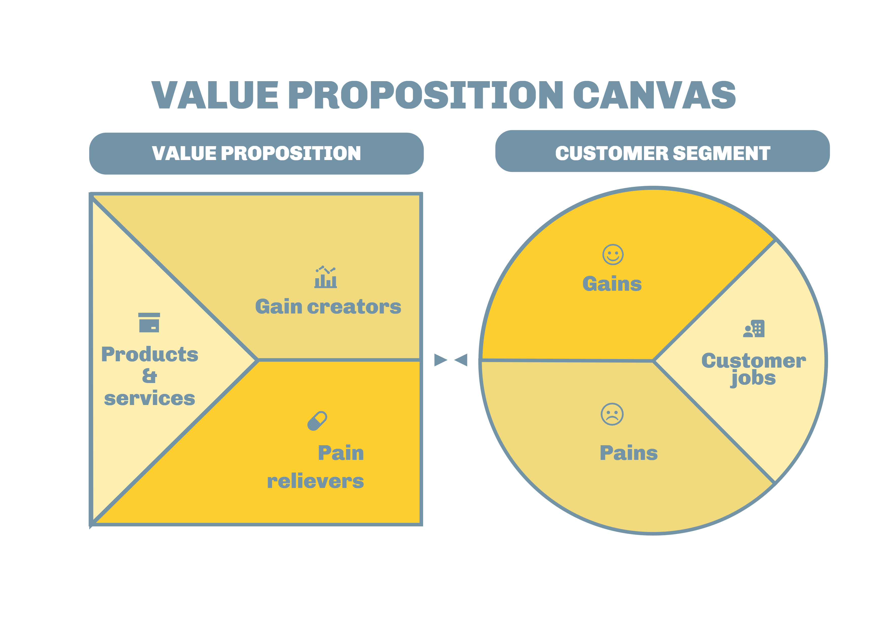

  Documentation

SatsConf 2023

# UnJorn

## Authors

*Arthur Tsukamoto*

*Guilherme Jesus Moura*

*Marcelo Maia Fernandes Filho*

*Samuel Lucas de Almeida*

*Yago Phellipe Matos Lopes*

## Summary

- [UnJorn](#unjorn)
  - [Authors](#authors)
  - [Summary](#summary)
  - [Solution Description](#solution-description)
  - [Business Analysis](#business-analysis)
    - [Canva Value Proposition](#canva-value-proposition)
      - [Customer Segment:](#customer-segment)
      - [Gains:](#gains)
      - [Pains:](#pains)
      - [Customer Jobs:](#customer-jobs)
      - [Value Proposition](#value-proposition)
      - [Pain relievers:](#pain-relievers)
      - [Gain creators:](#gain-creators)
  - [Functional Requirements](#functional-requirements)
    - [User Stories](#user-stories)
  - [Folder Structure](#folder-structure)
  - [Technologies](#technologies)

## Solution Description

UnJorn is a groundbreaking social network that utilizes Nostr and Lightning Network technologies to empower independent journalists globally. Its main objective is to ensure the security and independence of journalists reporting on critical issues like corruption, war, and repression. UnJorn's decentralized structure, driven by Nostr, guarantees freedom from external control, while the Lightning Network facilitates quick and secure payments, addressing common challenges faced by independent journalists. The platform not only safeguards journalists but also sheds light on hidden issues, contributing to a more informed global community. UnJorn is an innovative response to the changing world, where freedom of expression and truth are paramount. It serves as a vital tool for journalists dedicated to informing us about pressing global matters.

## Business Analysis

### Canva Value Proposition

The Value Proposition Canvas is a strategic tool that helps businesses better understand their customers and create products or services that precisely address customer needs and pain points.

#### Customer Segment:

#### Gains:

*Security and Independence*: Independent journalists gain the security to report on critical issues such as corruption, war, and repression without fear of censorship or external control.

*Visibility for Important Issues*: The platform highlights frequently hidden issues, helping to raise awareness about critical problems worldwide.

#### Pains:

*Technical Expertise*: Some journalists may lack the technical expertise required to effectively use the Nostr and Lightning Network technologies, potentially making it challenging for them to fully benefit from the platform.

*Negative Feedback and Criticism*: Exposing themselves to a broader audience can lead to negative feedback and criticism, which may affect the emotional well-being and motivation of journalists

#### Customer Jobs:

*Ensuring Freedom of Expression*: Journalists want to exercise their right to freedom of expression without external censorship or control.

*Highlighting Hidden Issues*: Journalists aspire to bring attention to hidden or overlooked issues, contributing to a more informed global community.

#### Value Proposition

*Products & Services*:

UnJorn is the decentralized social network platform that empowers independent journalists to report crucial news, such as corruption and repression, through the integration of Nostr and Lightning Network technologies, ensuring freedom, security, and fair recognition.

#### Pain relievers:

*User-Friendly Interface*: Designing an intuitive and user-friendly interface can lower adoption barriers and encourage users to embrace the decentralized platform.

*Training and Support*: UnJorn can provide comprehensive training and support for journalists to help them navigate and make the most of the platform, mitigating the technical expertise challenge.

#### Gain creators:

*Secure Payment System*: The integration of the Lightning Network ensures that journalists receive prompt and secure payments for their work, providing financial stability and motivation.

*Highlighting Critical Issues*: UnJorn shines a light on frequently hidden issues, helping raise awareness about critical problems worldwide.

## Functional Requirements

Functional requirements are detailed specifications of the operations and functionalities that a software system must perform to meet user needs and project objectives. They describe what the system should do, defining user actions, system operations, and relevant constraints, providing an essential foundation for system design, development, and testing, as well as for validating that it meets established criteria.

### User Stories

User stories are a fundamental component of agile software development, serving as concise descriptions of specific pieces of functionality from a user's perspective. Typically written in a simple, structured format, a user story outlines who the user is, what they want, and why they want it. This framework helps the teams to understand the user's needs and prioritize work, fostering collaboration and flexibility in delivering software that aligns with customer requirements.

1 - As an independent journalist, I would like to publish my news articles so that others can see what is happening in my country.

2 - As a reader, I would like to filter news by continents or by most engaged articles by subject so that I can stay informed about a specific topic.

3 - As a user, I would like to donate sats (satoshis) so that I can contribute to independent journalists.

4 - As an independent journalist, I want to be able to track reader feedback to understand whether they are liking or disliking my news.

5 - As an independent journalist, I would like to have a profile with a bio and portfolio section to showcase my work and expertise.

## Folder Structure

- **Documents**
- **Backend**
   - api_alby
      - controller
      - routes
   - api_lnbit
      - controller
      - routes
- **Frontend**
   - public
   - src
      - assets
      - components
      - lib
      - pages
      - routes
- **websocket**
- **ReadMe.md**

## Technologies

- **Lightning:** Refers to the Lightning Network, a high-performance cryptocurrency payment network that enables fast and low-cost transactions on the blockchain.

- **Nostr:** Nostr is an open-source technology that helps decentralize social networks and applications, ensuring data ownership by users.

- **React:** A popular JavaScript library for building interactive and reactive user interfaces.

- **TypeScript:** A programming language that adds static typing to JavaScript, making development more robust and secure.

- **LnBits:** A Lightning Network payment platform that facilitates cryptocurrency transactions and microtransactions.

- **Alby:** Alby is a wallet for the lightning network.

- **Tailwind:** A CSS framework that allows for rapid web interface development with reusable style classes.

- **Vite:** A fast build and development system for web applications that is particularly efficient and configurable.

- **CSS:** Cascading Style Sheets (CSS) is a language used to style the presentation of HTML documents.

- **Node.js:** A JavaScript runtime environment that enables the building of scalable and high-performance server applications.
